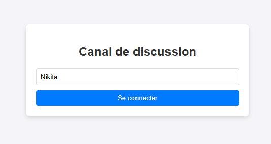
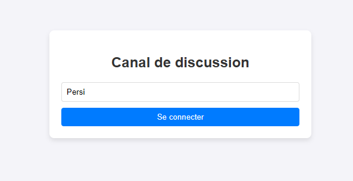
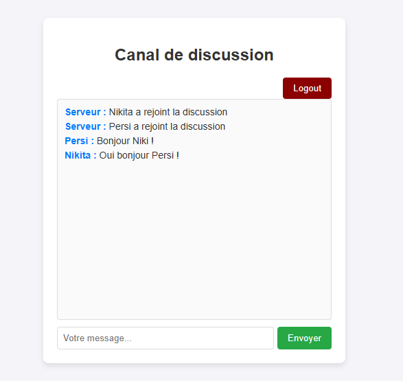

#  Broadcast Server

Un serveur de diffusion en temps réel construit avec Java et Spring Boot, permettant aux clients de se connecter et d'échanger des messages via WebSocket. Ce projet est inspiré du challenge [Broadcast Server](https://roadmap.sh/projects/broadcast-server) de roadmap.sh.

##  Table des matières

- [Aperçu](#-aperçu)
- [Fonctionnalités](#-fonctionnalités)
- [Prérequis](#-prérequis)
- [Installation](#-installation)
- [Utilisation](#-utilisation)
- [Interface Web](#-interface-web)
- [Architecture technique](#-architecture-technique)
- [Messages et protocole](#-messages-et-protocole)
- [Exemples](#-exemples)
- [Contribution](#-contribution)

##  Aperçu

Le **Broadcast Server** est une application de chat en temps réel qui démontre l'utilisation des WebSockets pour la communication bidirectionnelle entre un serveur et plusieurs clients. Le projet comprend :

- Un serveur WebSocket Spring Boot
- Un client CLI (Command Line Interface)
- Une interface web HTML/JavaScript

##  Fonctionnalités

-  **Communication en temps réel** via WebSocket
-  **Multi-clients** : Support de connexions simultanées illimitées
-  **Historique des messages** : Conservation des 35 derniers messages
-  **Notifications système** : Annonce des arrivées et départs
-  **Double interface** : CLI et Web
-  **Gestion d'erreurs** : Reconnexion automatique et gestion des déconnexions
-  **Format JSON** : Communication structurée entre client et serveur


##  Prérequis

- **Java 17+** installé sur votre machine
- **Maven 3.6+** pour la compilation
- Un terminal/console pour exécuter les commandes

##  Installation

### 1. Cloner le dépôt

```bash
git clone https://github.com/Anfrejkvlv/BroadCastServer.git
cd BroadCast Server
```

### 2. Compiler le projet

```bash
mvn clean package
```

Cela génère un fichier JAR exécutable dans le dossier `target/`.

##  Utilisation

### Démarrer le serveur

```bash
java -jar target/BroadCastServer-1.jar start
```

Le serveur démarre sur le port **8085** et écoute les connexions WebSocket sur `ws://localhost:8085/broadcast`.

**Sortie attendue :**
```
BroadCastServer démarré sur le port:8085...
```

### Connecter un client CLI

Dans un nouveau terminal :

```bash
java -jar target/BroadCastServer-1.jar connect
```

**Processus de connexion :**

1. Le système demande votre pseudo
2. La connexion s'établit avec le serveur
3. Vous recevez l'historique des 35 derniers messages
4. Vous pouvez commencer à échanger avec les autres utilisateurs

**Exemple de session :**

```
Entrez votre pseudo: Alexandra Odinov
 Connexion établie avec le serveur!
 Connecté ! Tapez vos messages (tapez 'exit' pour quitter)...
 > Bonjour tout le monde !
[Serveur] : Persi a rejoint la discussion
[Persi] : Salut Alexandra Odinov !
 > Comment ça va ?
```

### Commandes disponibles

| Commande | Description |
|----------|-------------|
| `start` | Démarre le serveur WebSocket |
| `connect` | Connecte un client CLI au serveur |
| `exit` | Déconnecte le client (disponible une fois connecté) |

##  Interface Web

Une interface web est également disponible pour une expérience utilisateur plus conviviale.






### Accéder à l'interface web

1. Démarrez le serveur : `java -jar target/BroadCastServer-1.jar start`
2. Ouvrez votre navigateur à l'adresse : **http://localhost:8085**
3. Entrez votre pseudo et cliquez sur "Se connecter"

### Fonctionnalités de l'interface web

-  Affichage des messages en temps réel
-  Gestion du pseudo
-  Scroll automatique vers les nouveaux messages
-  Bouton de déconnexion
- ️ Messages système différenciés (INFO)

##  Architecture technique

### Technologies utilisées

- **Spring Boot 4.0.0** : Framework Java pour l'application
- **Spring WebSocket** : Support natif des WebSockets
- **Jackson** : Sérialisation/désérialisation JSON
- **Java NIO** : Communication réseau non-bloquante
- **ConcurrentHashMap** : Gestion thread-safe des sessions

### Composants principaux

#### 1. `BroadcastHandler.java`

Gère le cycle de vie des connexions WebSocket :

- **Connexion** : Enregistrement du client et envoi de l'historique
- **Réception** : Traitement des messages entrants
- **Diffusion** : Broadcast à tous les clients connectés
- **Déconnexion** : Nettoyage et notification


##  Messages et protocole

### Types de messages

#### 1. **JOIN** - Connexion d'un utilisateur

```json
{
    "type": "JOIN",
    "sender": "Alexandra Odinov",
    "content": null
}
```

**Réponse du serveur :**
- Envoi de l'historique des messages
- Broadcast d'un message INFO aux autres clients

#### 2. **CHAT** - Message de discussion

```json
{
    "type": "CHAT",
    "sender": "Alexandra Odinov",
    "content": "Bonjour tout le monde !"
}
```

**Traitement :**
- Ajout à l'historique
- Diffusion à tous les clients connectés

#### 3. **INFO** - Message système

```json
{
    "type": "INFO",
    "sender": "Serveur",
    "content": "Alexandra Odinov a rejoint la discussion"
}
```

**Cas d'utilisation :**
- Arrivée d'un nouveau membre
- Départ d'un membre
- Erreurs ou notifications

##  Exemples

### Scénario 1 : Conversation entre 3 utilisateurs

**Terminal 1 - Serveur**
```bash
java -jar BroadCastServer-1.jar start
```

**Terminal 2 - Alexandra Odinov**
```bash
java -jar BroadCastServer-1.jar connect
Entrez votre pseudo: Alexandra Odinov
  Connecté !
 > Bonjour !
```

**Terminal 3 - Persi**
```bash
java -jar BroadCastServer-1.jar connect
Entrez votre pseudo: Persi
[ Serveur] : Alice a rejoint la discussion
[Alice] : Bonjour !
 Connecté !
 > Salut Alexandra Odinov !
```

**Terminal 4 - Nikita**
```bash
java -jar BroadCastServer-1.jar connect
Entrez votre pseudo: Nikita
[Alexandra Odinov] : Bonjour !
[Persi] : Salut Alexandra Odinov !
 Connecté !
 > Hey les amis !
```

### Scénario 2 : Mix CLI et Web

1. Démarrez le serveur
2. Connectez un client CLI nommé "Alexandra Odinov"
3. Ouvrez http://localhost:8085 dans votre navigateur (utilisateur "Persi")
4. Les messages échangés apparaissent sur les deux interfaces en temps réel

##  Contribution

Les contributions sont les bienvenues ! Voici comment participer :

1. **Fork** le projet
2. Créez une **branche** pour votre fonctionnalité (`git checkout -b feature/NewFeature`)
3. **Committez** vos changements (`git commit -m 'Add some NewFeature'`)
4. **Pushez** vers la branche (`git push origin feature/NewFeature`)
5. Ouvrez une **Pull Request**

### Guidelines

- Suivez les conventions de code Java existantes
- Ajoutez des tests pour les nouvelles fonctionnalités
- Mettez à jour la documentation si nécessaire
- Assurez-vous que le build Maven passe (`mvn clean verify`)


##  Remerciements

- [roadmap.sh](https://roadmap.sh/projects/broadcast-server) pour l'inspiration du projet
- [geeksforgeeks.org](https://www.geeksforgeeks.org/springboot/spring-boot-web-socket/) pour le guide, cela m'a aidé pour la compréhension du concept des Websocket avec Spring Boot
- La communauté Spring Boot pour la documentation exceptionnelle
- Tous les contributeurs qui ont participé à ce projet

---
Lien du projet : [https://roadmap.sh/projects/broadcast-server](https://roadmap.sh/projects/broadcast-server)
 **Notez (avec les étoiles) le projet vous a été utile !** 